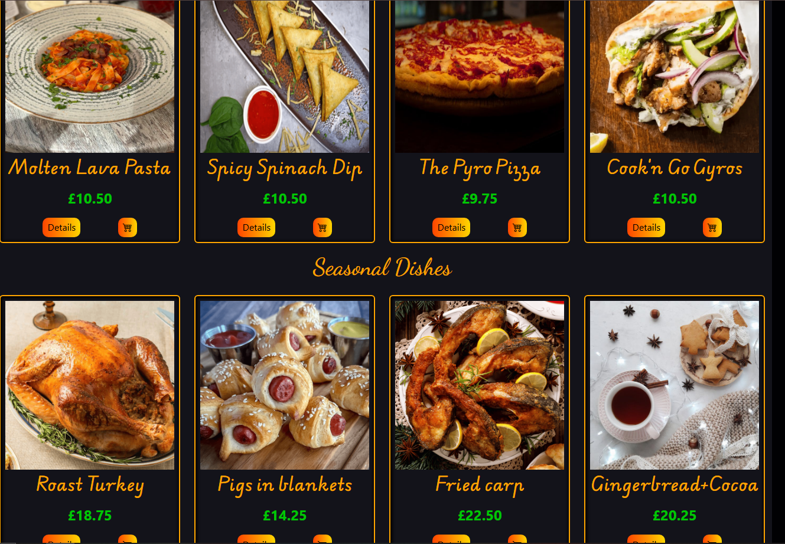
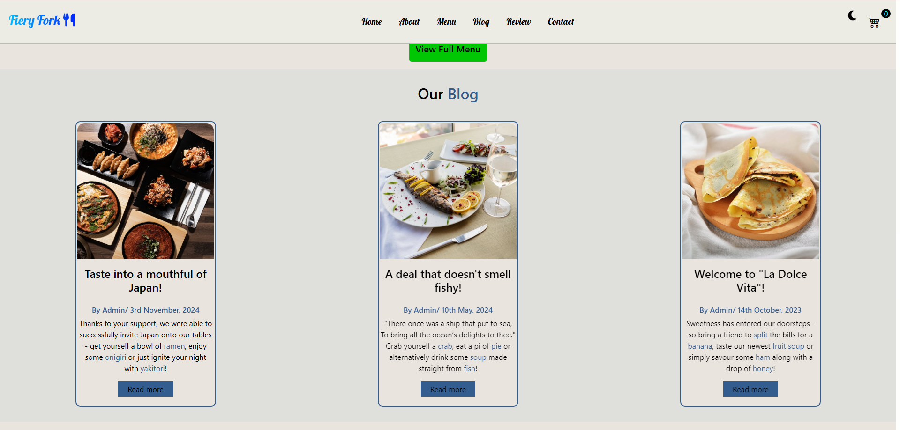
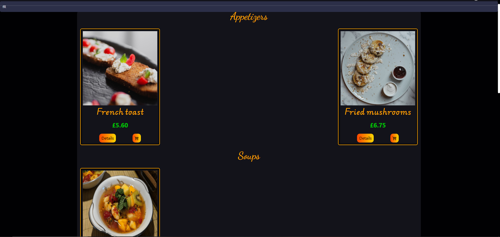
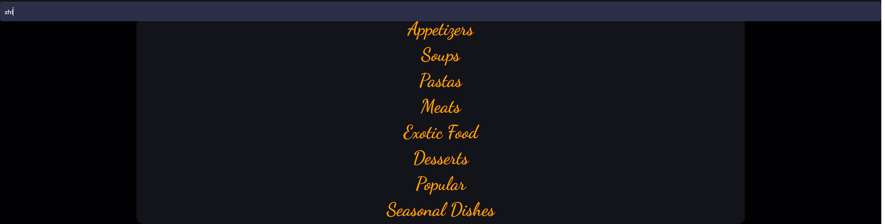
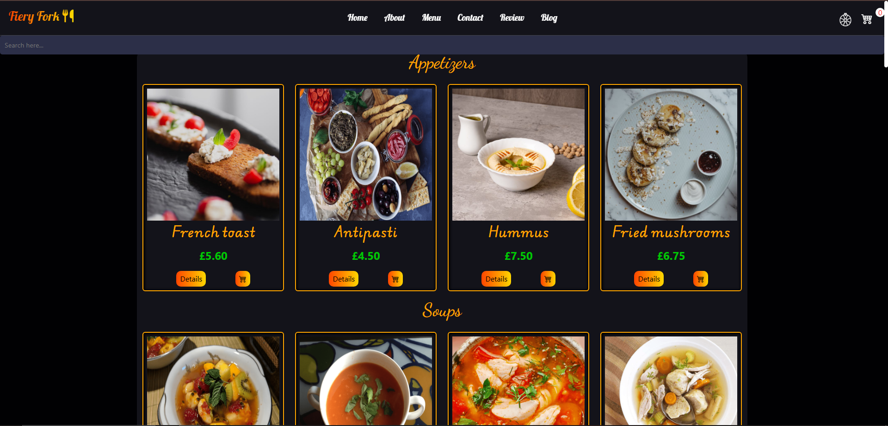

# SPD-Proj3 - Egy étterem , avagy a "Fiery Fork Restaurant" oldaltörténete

# "Kemencétől az asztaláig!"

## A projekt célja

Ez a projektmunka eredetileg azzal a céllal indult, hogy egy interaktív éttermi oldalt készítünk el. Az eddig megszokott, már-már hagyományos elemek (pl. HTML kártyák) mellett különböző interakciós részeket (pl. dinamikus tartalomhívás; ajánlat szűrése, keresése; kosár használata) szándékoztunk beilleszteni.

## Működése (felhasználó)

- ### angol nyelv ismerete ajánlott!
- eleinte egy étterem weboldalának főoldala látható, melynek részei közt görgetéssel vagy a fenti menüpontokkal lehet mozogni
- az egyes pontok betöltődéskor valamely oldalról "belebegnek", ezzel is építve az ergonómikusságát a weblapnak
- menünk vizsgálatakor az ételek között az oldalsó nyilakkal és húzással, oldalgörgetéssel egyaránt lehet lépni, e szekció alján pedig egy gomb található (View full menu), mely elvisz egy másik oldalra - itt lelhető a teljes menü
    - a tetején található keresősáv "dinamikusan", gomb megnyomása nélkül, automatikusan keres és szűr egyben.
    - a kártyák (amikben az ételek képei, árai és nevei találhatóak) képernyőmérettől függően rendeződnek kategóriánként sor(ok)ba, ezzel biztosítva a széleskörű olvashatóságot
    - ezek alján 2 gomb van:
        - a "details" gombra kattintva elhomályosul a háttér, és előtérbe kerül az adott étel képe és neve, valamint egy rövid leírás társul hozzá
        - a kosár gomb pedig kosárba helyezi az adott árut a megnyomás mennyiségeszer
- ezen kívül még egy blog és egy értékeléses rész színesíti az oldalt
- ezek alatt található egy térkép, illetve mellette pár adat megadása és egy üzenet megírása után lehet üzenni is
    > Figyelem! A térkép a legtöbb telefonon nem elérhető, ennek láthatósági okai vannak
- a láblécben pedig elérhetőségi címek és a nyitvatartásunk látható
    > Az X, Instagram és Facebok névre rákattintva eljuthat közösségi médiáinkra
- a bal felső sarkokban (mindkét oldalon) található egy kiskosár ikon, s ennek egyszeri megnyomásakor előjön egy kisablak, melyben minden kosarazott termék (a megfelelő mennyiségben) megjelenik, s ezeknek egység- és teljes ára is látszik
    - a "Purchase" kattintásra tudomásul veszi a vásárlást, majd kiüresití kosarunk

## Fejlesztés

  - Fejlesztői- és segédfelületek
    - Visual Studio Code
    - Git, Github
    - Trello
    - Bootstrap
  - Programozási nyelvek:
      - HTML
      - CSS
      - JS

  ### Git, Github
  * eredet: 1 ág (main) --> folyamatok - branchek
    - project1 - főoldal design, működés jelentős része
    - <ins>Font&Pictures</ins> - a menüoldal képei, nevek és eredeti kinézet (később változott)
    
  * vége: main

  ## Egyéni hozzájárulás
  - Trello vezetése
  - Menüoldal tervezése (képek, címek, elrendezés)
  - 
  - Keresősáv - dinamikus szűrés
  - SM kezelése (segítség a létrehozásban, teljes kezelés)
  - 
  - 
  - 
  - inverzszínek keresés (sötét-világos téma)
  - 
  - Blog és review
  - 
  - Reszponzivitás

  ## Főbb funkciók tőlem (JS)

- Dinamikus szűrés és keresés

```
  const searchB = document.querySelector('#searchB');
    searchB.addEventListener('input', searchDish)

    function searchDish() {
    const searchTerm = searchB.value.toLowerCase();
    const cards = document.querySelectorAll('.cardCust');

    cards.forEach(card => {
        const title = card.querySelector('h3').textContent.toLowerCase();
        if (title.includes(searchTerm)) {
            card.style.display = '';
        } else if (searchTerm === '') {
            card.style.display = '';
        } else {
            card.style.display = 'none';
        }
    });
    }
```
  
| Függvény       | Bemenet | Várt Eredmény                                                                                                | Tényleges Eredmény                                                                        |     |
| -------------- | ------- | ------------------------------------------------------------------------------------------------------------ | ----------------------------------------------------------------------------------------- | --- |
| `searchDish()` | "fR"    | Minden étel, mely nem tartalmazza a következők valamelyikét: "fr","FR","Fr","fR" - eltűnik, a többi megmarad | Ami nem tartalmazta a felülírottak valamelyikét, nem látszódott, de nem tűnt el az összes |     |
| `searchDish()` | "xhl"   | Nem jelenik meg étel (egyik sem tartalmazza e karaktersort)                                                  | Egyik étel sem látszódik                                                                  |     |
| `searchDish()` | ""      | Minden étel megjelenik                                                                                       | Mindenik kártya jelen vagyon, látható formában                                            |     |





> ### A dokumentáció készítője: ShadowWarrior23/x (Bence)